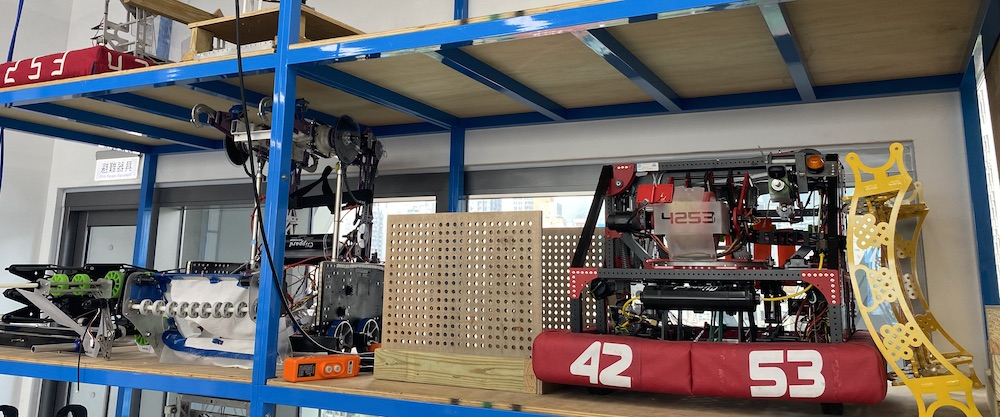
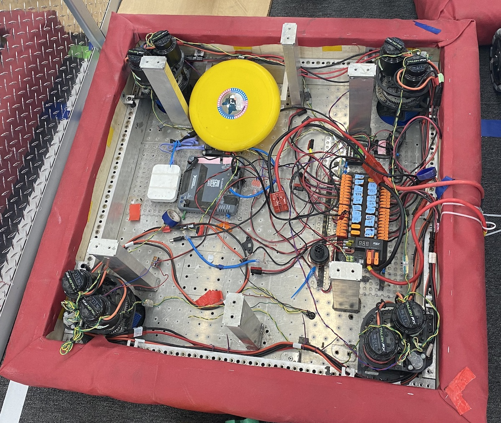
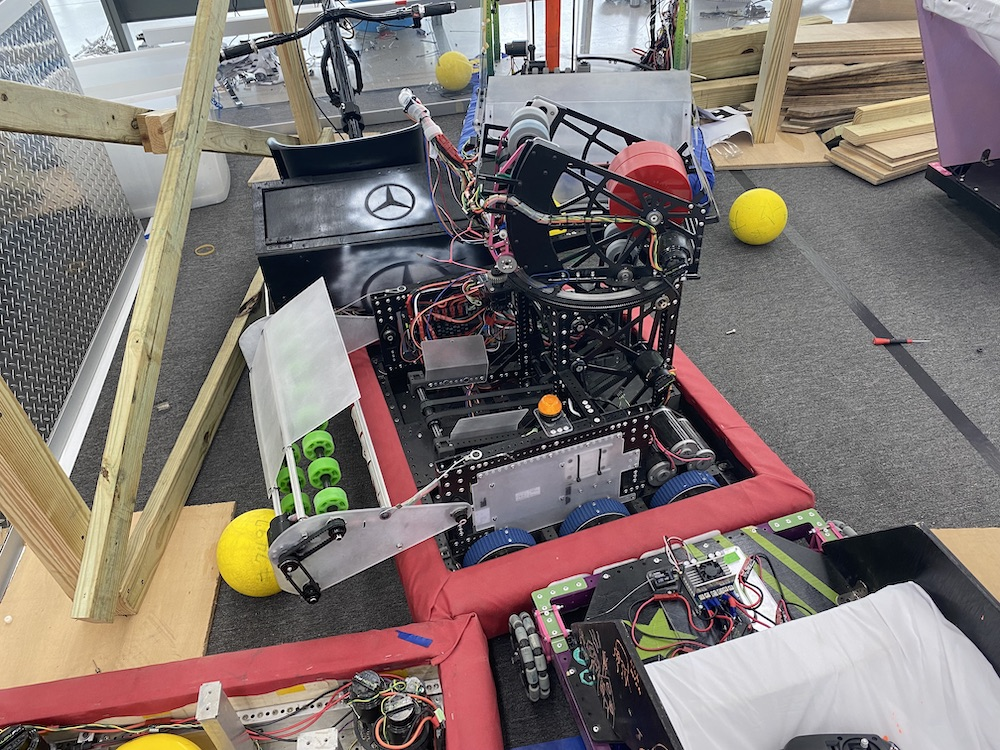
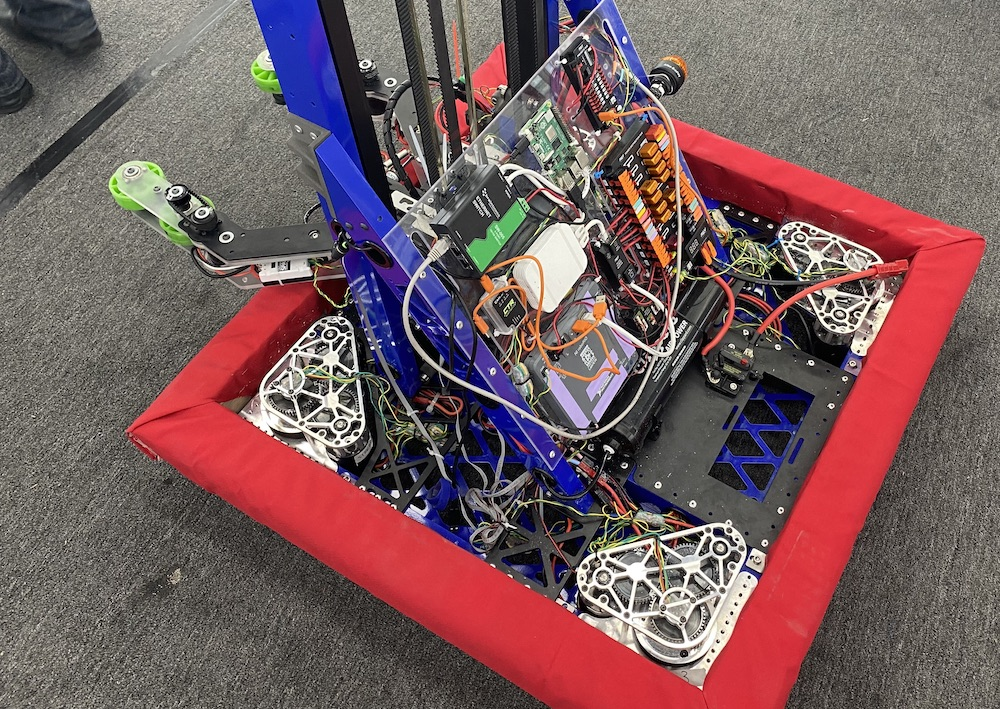
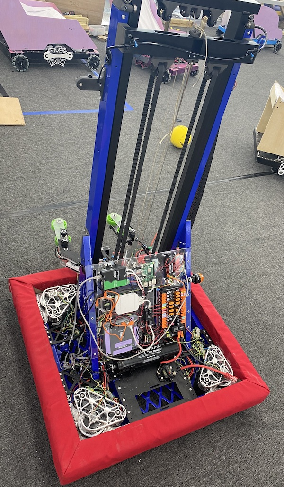

# reactivate23
Restarting FRC in 2023

The software on the Windows machine was lost, so we had to start from scratch to get a firmware image for the robotRIO and resurrect the FRC robot built by Team 426.

We have an [AM14U5 drive base](https://www.andymark.com/pages/bundles-drive-systems-bases-chassis-am14u-family-chassis-am14u5) - and it is a great starting point. [Swerve modules](https://www.andymark.com/products/mk4i-swerve-modules) might come later.

## Get the required programs

Following the recommendation from [WPILIB](https://docs.wpilib.org/en/stable/) we fist installed the following programs on our Windows machines:

- [LabView FRC](https://docs.wpilib.org/en/stable/docs/zero-to-robot/step-2/labview-setup.html#installing-labview-for-frc-labview-only) (Windows only)
- [VS Code](https://docs.wpilib.org/en/stable/docs/zero-to-robot/step-2/wpilib-setup.html#wpilib-installation-guide)
- [FRC Driver Station Powered by NI LabVIEW](https://docs.wpilib.org/en/stable/docs/software/driverstation/driver-station.html#frc-driver-station-powered-by-ni-labview) (Windows Only)
- [FRC roboRIO Imaging Tool](https://docs.wpilib.org/en/stable/docs/zero-to-robot/step-2/frc-game-tools.html#installing-the-frc-game-tools) (Windows Only)
- [FRC Radio Configuration Utility](https://docs.wpilib.org/en/stable/docs/zero-to-robot/step-3/radio-programming.html#programming-your-radio) (Windows Only)
- [FRC Driver Station Log Viewer](https://docs.wpilib.org/en/stable/docs/software/driverstation/driver-station-log-viewer.html#driver-station-log-file-viewer) (Windows Only)
- [RobotBuilder](https://docs.wpilib.org/en/stable/docs/software/wpilib-tools/robotbuilder/index.html#robotbuilder)

## Hardware design and documentation

We want to be swappable to return to PWM with a simple radio controller. And otherwise run CAN bus and control motor temperature (see [RESET 2023 event](https://github.com/ssis-robotics/reset23) )

## Software
### Creating the firmware image

This took quite some time, even on our i7

### Configuring the firmware

The motors on the CAN bus need to be addressed. But how? Can we give them individual names (configure the Talon SRX)

### Connect the Joystick controller to the Windows machine and drive the robot over Wifi

We'll see about that.

### Reactivate drive control

On Monday we installed the FRC Game Tools, connected to the 426 Wifi, activated the sensors, reconnected all Talon SRX to the CAN bus - and with a USB flight stick Logitech we were able to control the robot again! Some software updates for the motor controllers were needed, but with Phoenix Tuner X fast accomplished.

## Inspiration at TAS in December 2022

The visit was great. Team 4253 would like to support us - we need to make contact! They have some vintage robots to learn from:

Build a robot for the previous sesion by freshmen teams to learn from working desigs (see below) and run example bots with [SDS MK4i Swerve Modules](https://www.andymark.com/products/mk4i-swerve-modules), driven by eight [Talon FX](https://store.ctr-electronics.com/falcon-500-powered-by-talon-fx/):

## Start of FRC at SSIS in 2019

Evan Weinberg @emwdx started the collaboration with 5 other schools to bring FRC to SSIS and Vietnam. The stages are documented in the repository https://github.com/ssis-robotics/Team426Robot 
